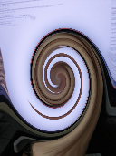
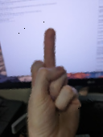

# Unswirl

Here is a program to unswirl images

Took me about two hours, most of that was figuring out that BufferedImages don't have alpha channels
if you load them from a jpeg, and making noodles for the kids.

[Code](src/main/kotlin/Main.kt)

## Input Image

## Swirled Image

## Unswirled Image
